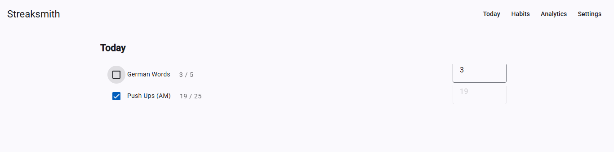
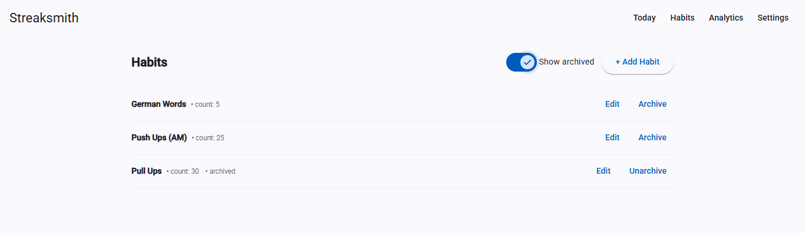
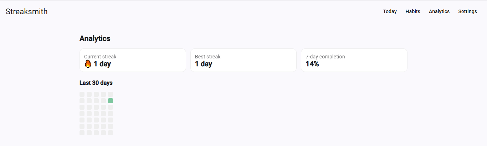

Streaksmith — Habit Tracker (Angular)

A minimalist habit tracker built with Angular 20, Angular Material, Signals, and IndexedDB (Dexie). Log daily habits, track streaks, and see a 30-day heatmap — works offline.
Live demo: https://KoBe1628.github.io/streaksmith
✨ Features
• Create / edit / archive habits
• Daily checklist with optional numeric value (reps/minutes)
• Offline persistence (IndexedDB via Dexie)
• Analytics: current streak, best streak, 7‑day completion, 30‑day heatmap
• Export / import JSON backup
• Clean, responsive UI (Angular Material)
🖼️ Screenshots
| Today | Habits | Analytics |
|------|--------|-----------|
|  |  |  |

🛠 Tech
Angular 20 (standalone + Signals) · Angular Material · Dexie (IndexedDB) · date‑fns
🚀 Local development
npm install
ng serve
# http://localhost:4200

📦 Build
ng build --configuration production
☁️ Deploy (GitHub Pages)
This repo includes a GitHub Actions workflow that:
1) Builds with `--base-href /streaksmith/`
2) Copies `index.html` → `404.html` for SPA routing
3) Publishes to GitHub Pages

See `.github/workflows/deploy.yml`.
🗺 Folder highlights
src/app/
  core/
    models/            # Types
    db/dexie-db.ts     # IndexedDB (SSR-safe)
    store/habit.store.ts
  features/
    today/             # Checklist + numeric value
    habits/            # List, add/edit, archive, filter
    analytics/         # KPIs + 30-day heatmap
    settings/          # Export/import JSON

🗓 Roadmap
• Custom frequency (days of week)
• Notifications
• Multi-habit charts
• Dark mode
👤 Author
Built by Kodirov Bekhzod. Open to Angular internship / working student roles.
[REMOVE BEFORE COMMIT] Replace <YOUR NAME> and ensure the live link uses your GitHub username.
